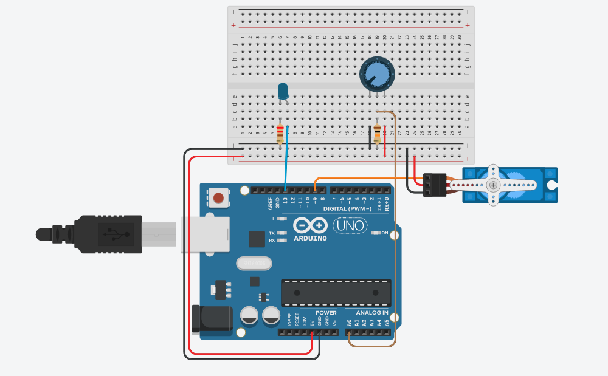
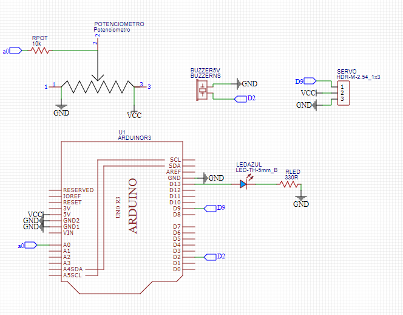
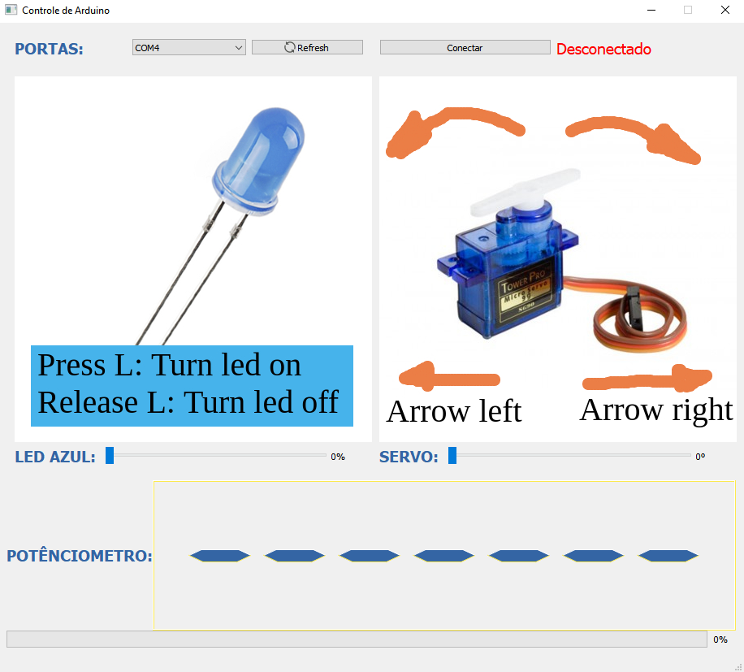
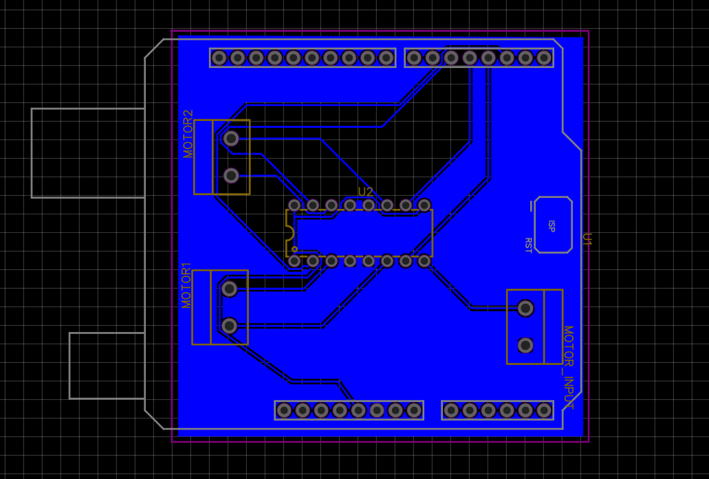
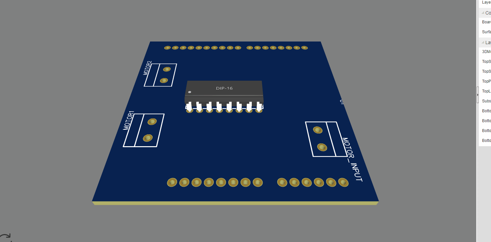

<h1 align="center">
  
</h1>

---

<!-- 

-->

<h3 align="center">
  Uso de linguagens de programação para uma maior diversidade de projetos.
</h3>

## Índice

+ [Sobre](#sobre)
  + [Circuito](#circuito)
  + [Interface Gráfica](#interface-grafica)
  + [Placa de Circuito Impresso (PCB)](#pcb)
+ [Primeiros Passos](#comecando)
  + [Pré-requisitos](#pre_req)
  + [Instalação](#instalacao)
+ [Uso](#uso)
+ [Código](#codigo)
  + [Código Arduino](#codigo-arduino)
  + [Código Qt](#codigo-qt)
+ [Melhorias](#todo)

<h2 id="sobre">Sobre</h2>

Hoje projetos de hardware não sobrevivem mais apenas com hardware, pois a tendência é sempre ter cada vez mais tecnologias e dispositivos conectados. Cada vez mais temos opções de softwares que integram dispositivos, fornecem dados e interagem com o usuário de maneira simples e intuitiva. Além disso, sabemos que projetos com Arduino e componentes eletrônicos são capazes de realizar inúmeras tarefas e serem utilizados em diversas soluções tecnológicas para problemas do dia a dia. Unindo isso ao poder do software, é possível potencializar a capacidade dos projetos e tirar mais ideias do papel, criando cada vez mais soluções e atingindo públicos diferentes.

O objetivo do projeto foi desenvolver uma interface gráfica para o controle e leitura de dados de alguns dispositivos conectados ao Arduino, a fim de comprovar a capcidade e validar conceitos de programação para a construção de um Software integrado com hardware.

O framework utilizado para o projeto foi o Qt, uma toolkit em C++ multiplataforma, ou seja, o software criado para este projeto funciona no Windows, Linnux e MacOS.

Abaixo você pode visualizar o circuito montado no simulador [Tinkercad](https://www.tinkercad.com/). Visto que o circuito validado é físico e integrado com um software que roda em um Sistema Operacional, a simulação não servirá para demonstrações, apenas para referência na visualização do circuito.

    
    
Figura 1. Representação do Circuito montado no Tinkercad

<h3 id="circuito">Circuito</h3>

    
    
Figura 2. Esquemático do Circuito

O circuito possui alguns componentes que juntos são capazes de provar vários conceitos na montagem de circuitos e programação para Arduino. O potênciometro funciona como um dispositivo que substitui a leitura de qualquer tipo de sensor, enquanto o led atua para validar dispositivos que ligam e desligam, além de testes com o PWM. Por último, o Servo Motor como um atuador, para se movimentar e atuar conforme a necessidade.

<h4 id="materiais">Lista de Materiais</h4>

+ Arduino Uno R3
+ Protoboard
+ Fios macho-macho
+ Led difuso 5mm
+ Potênciometro 10k Linear
+ Micro Servo Motor
+ Resistor 220Ω
+ Resistor 10kΩ

<h3 id="interface-grafica">Interface Gráfica</h3>

    
    
Figura 3. Interface simples de controle feita em Qt

<h3 id="pcb">Placa de Circuito Impresso (PCB)</h3>

    
    
Figura 4. Esquemático da PCB

    
    
Figura 5. Modelo 3D da PCB

<h2 id="comecando">Começando</h2>

Siga estas instruções para criar, replicar e modificar o modelo do projeto na sua máquina. 

<h3 id='pre_req'>Pré-requisitos</h3>

<h3 id='instalacao'>Instalação</h3>

<h2 id="uso">Uso</h2>

<h2 id="codigo">Código</h2>

<h3 id='codigo-arduino'>Código Arduino</h3>

<h3 id='codigo-qt'>Código Qt</h3>

<h2 id='todo'>Features</h2>

+ [ ] Feature 1
+ [ ] Feature 2
+ [ ] Feature 3
+ [ ] Feature 4

Alguns outros componentes básicos como push-button e sensor LDR seriam uma ótima adição ao projeto, porém o potênciometro

## Licença

Copyright © 2021 [Mateus Antonio da Silva](https://github.com/bittoin). 
This project is [MIT](https://github.com/bittoin/Qt-GUI-for-Arduino/blob/main/LICENSE) licensed.